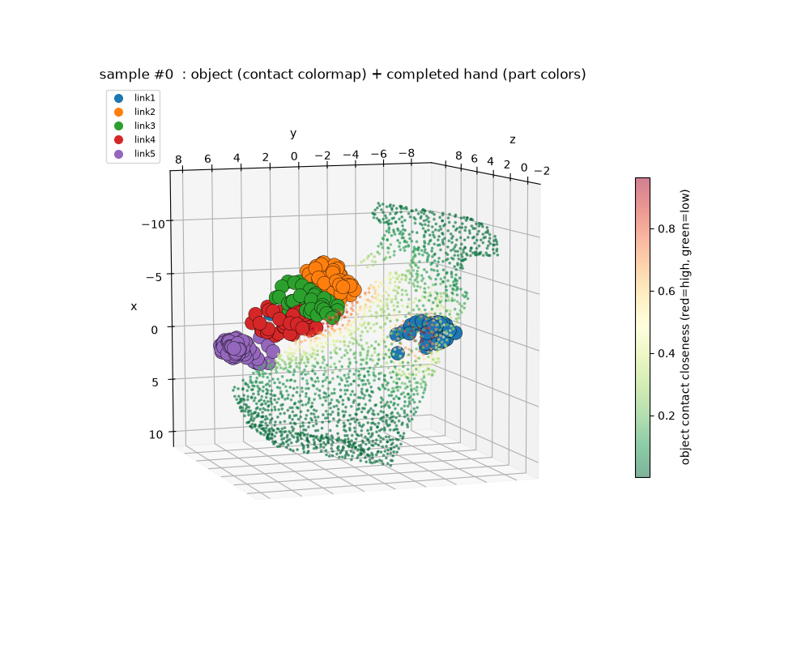
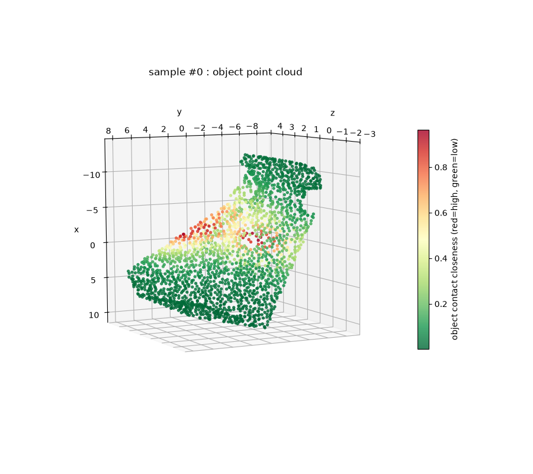
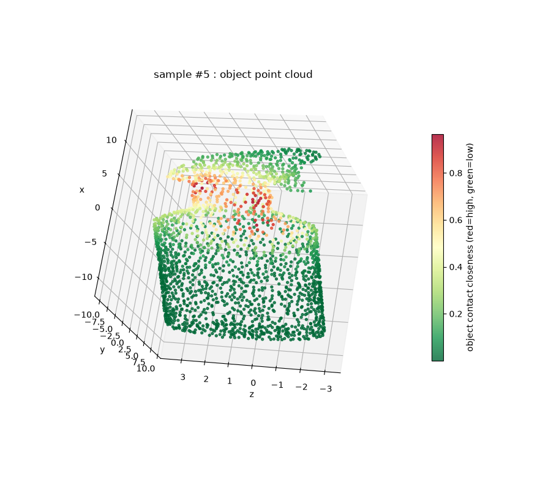
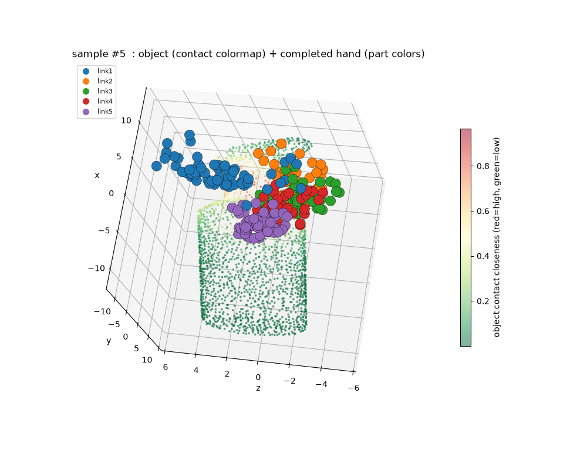
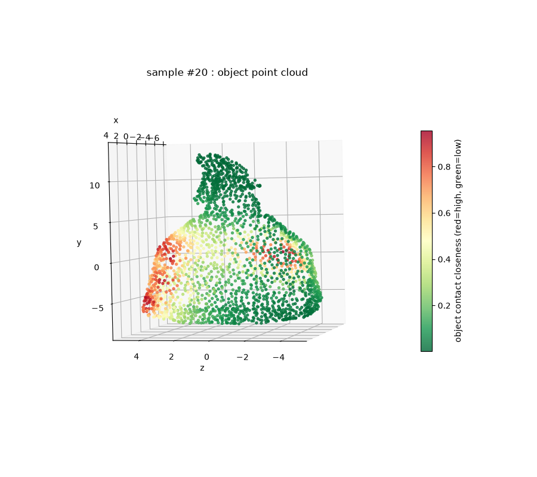
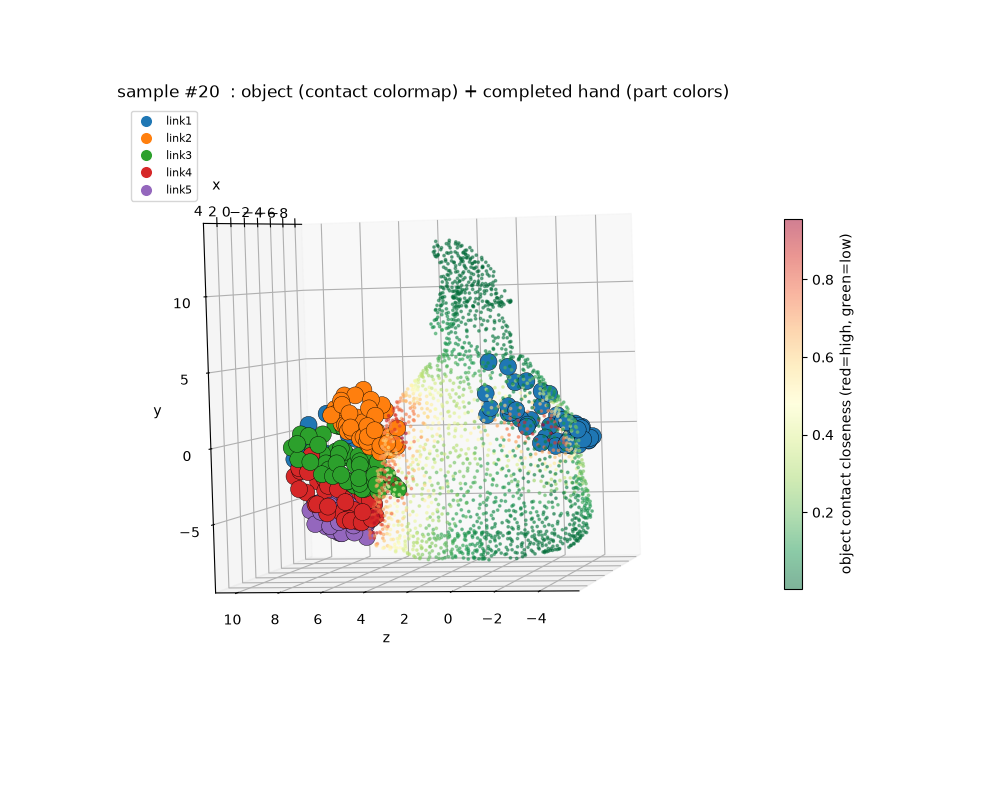

# PVD_hand — Human-Hand Point-Cloud Completion (Diffusion)

[简体中文](README.md) | [English](README.en.md)

Human-hand point-cloud **completion** based on **Point-Voxel CNN (PVCNN2) + diffusion**. Given a partial point cloud of the grasped object as conditioning, the model completes a **human hand point cloud** through reverse diffusion, predicting a finger-part label for each hand point.



---

## Data Source (important)

This work uses the **S2HGD** dataset (*Single-view Scene-to-Human Grasp Dataset*):

> Yan-Kang Wang, Chengyi Xing, Yi-Lin Wei, Xiao-Ming Wu, Wei-Shi Zheng.
> **Single-View Scene Point Cloud Human Grasp Generation.** arXiv:2404.15815, 2024.

S2HGD contains about **99,000 single-object, single-view scene point clouds** covering **1,668 distinct objects**, each with **one human-grasp annotation** (captured from real grasps). This repository fits those grasps to the **MANO** hand model and converts them into point clouds, producing `manohand.pt` for hand point-cloud completion. **Data copyright belongs to the original authors**; please follow their license.

> ⚠️ **Note: only the DATA comes from S2HGD; the CODE in this repo is unrelated to that paper** — it is an independent PVCNN2-based diffusion implementation for human-hand point-cloud completion.

## Results

Image naming in `assets/`: `Figure_<id>_1` = **object point cloud**, `Figure_<id>_2` = **object + completed hand** (`<id>` is the sample/object index).

| Object #0 | Object #0 + completed hand |
|---|---|
|  |  |

| Object #5 | Object #5 + completed hand |
|---|---|
|  |  |

| Object #20 | Object #20 + completed hand |
|---|---|
|  |  |

---

## Environment

- Python ≥ 3.10 (3.12 recommended); Linux + NVIDIA GPU.
- **PyTorch must be a CUDA build that supports your GPU's compute capability.** E.g. RTX 50 series (Blackwell, sm_120):

```bash
micromamba create -n pvd_hand -c conda-forge python=3.12
micromamba run -n pvd_hand pip install torch torchvision \
    --index-url https://download.pytorch.org/whl/cu130
micromamba run -n pvd_hand pip install -r requirements.txt
```

**CUDA op compilation**: the core ops in `modules/functional` are **JIT-compiled on first import** (cached under `.torch_extensions/`, reused afterwards). Requires `nvcc` + `gcc/g++` + `ninja`. `modules/functional/backend.py` builds for `sm_120` by default — change its `-gencode` for other GPUs.

## Data Preparation

Data is not committed. Put `manohand.pt` under `datasets/`:

```
datasets/manohand.pt
```

Format (a `torch.save` dict): `{"hands": Tensor[N,300,5], "objs": Tensor[N,2048,5]}`.
Channels: `0..2 = xyz`, `3 = hand-part label (1..5)`, `4 = contact closeness (0..1)`.
See **[DATASET.md](DATASET.md)** for provenance, generation pipeline and per-file details.

## Pretrained Model

The released checkpoint is:

```
checkpoints/epoch_599.pth
```

> It is large (~330MB) and **not stored in the git repository** (see `.gitignore`). Download it from the release page / cloud drive and place it under `checkpoints/`.
> It is a joint multi-category run (manohand+shadowhand+allegro+ezgripper) at epoch 599, loadable into this repo's hand-completion model for inference.

## Training

```bash
python train_completion.py --distribution_type single --gpu 0 --bs 32 --niter 1000
```

Defaults already point to `datasets/manohand.pt`. Common flags: `--svpoints 50`, `--npoints 300`, `--nc 5`, `--bs` (use 32 on small GPUs), `--saveIter`, `--model <epoch_X.pth>` (resume/fine-tune).

## Inference (quantitative)

```bash
python test_completion.py --model checkpoints/epoch_599.pth --samples 0 5 20 --outdir output/completion
```

Runs diffusion sampling to obtain the completed hand, saves `sampleXXXX.npz` (GT hand + completed hand) and prints the **Chamfer distance**.

## Visualization (interactive & offline)

```bash
# Interactive popup (needs a display, e.g. WSLg/X11), rotate/zoom with the mouse
python viz_interactive.py --model checkpoints/epoch_599.pth --sample 5

# Headless: save PNGs (two per sample: object-only + object&hand combined)
python viz_interactive.py --model checkpoints/epoch_599.pth --samples 0 5 20 --save-only output/interactive_viz
```

---

## Repository Layout

```
PVD_hand_new/
├── assets/                    # README figures (Figure_<id>_1/_2)
├── checkpoints/               # pretrained weights (gitignored)
├── datasets/
│   ├── Rdataset.py            # data loader
│   └── manohand.pt            # data (gitignored, bring your own)
├── model/pvcnn_completion.py  # PVCNN2 completion backbone
├── modules/                   # PVCNN ops (python wrappers)
│   └── functional/            # CUDA kernels (auto JIT on first import)
├── utils/                     # file_utils / visualize / metrics
├── train_completion.py        # training
├── test_completion.py         # inference + Chamfer
├── viz_interactive.py         # interactive / offline visualization
├── DATASET.md                 # dataset documentation
├── requirements.txt
└── _deprecated_*              # old code/data/outputs (not committed)
```

## Citation (data only)

**The data comes from S2HGD; the code is unrelated to that paper.** If you use this data, please cite the S2HGD paper:

```bibtex
@article{wang2024single,
  title={Single-View Scene Point Cloud Human Grasp Generation},
  author={Wang, Yan-Kang and Xing, Chengyi and Wei, Yi-Lin and Wu, Xiao-Ming and Zheng, Wei-Shi},
  journal={arXiv preprint arXiv:2404.15815},
  year={2024}
}
```

## Notes

- `output/`, `.torch_extensions/`, `datasets/*.pt`, `checkpoints/*.pth`, `_deprecated_*` are all gitignored.
- This repo keeps only hand point-cloud completion (train/inference/visualization); other parts (generation, robotic hands, early processing) live under `_deprecated_*`.
